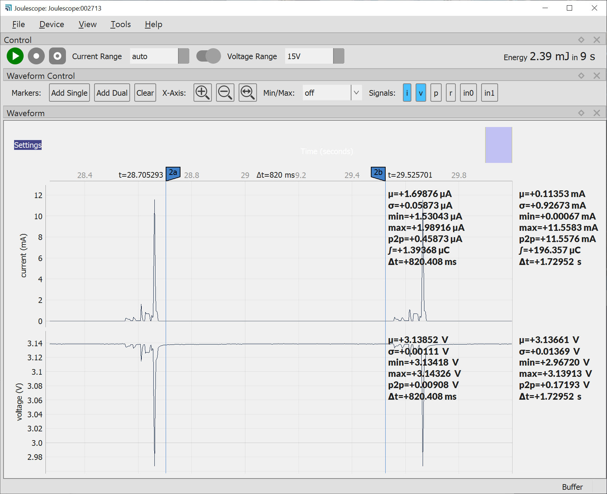
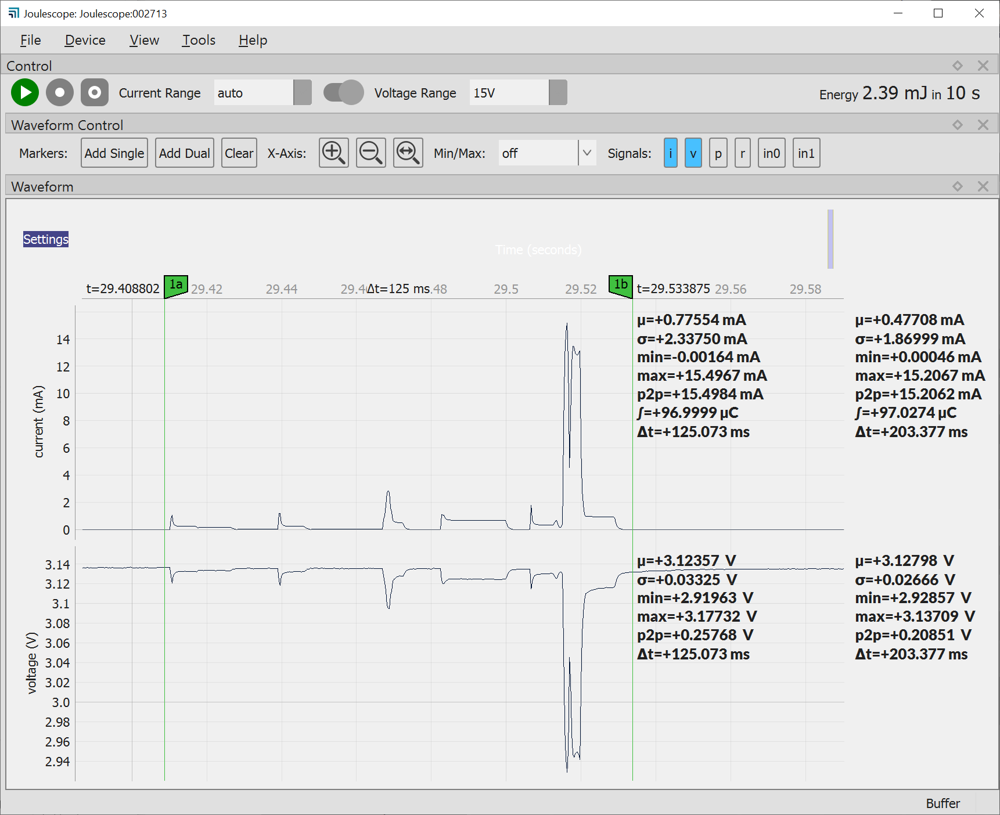
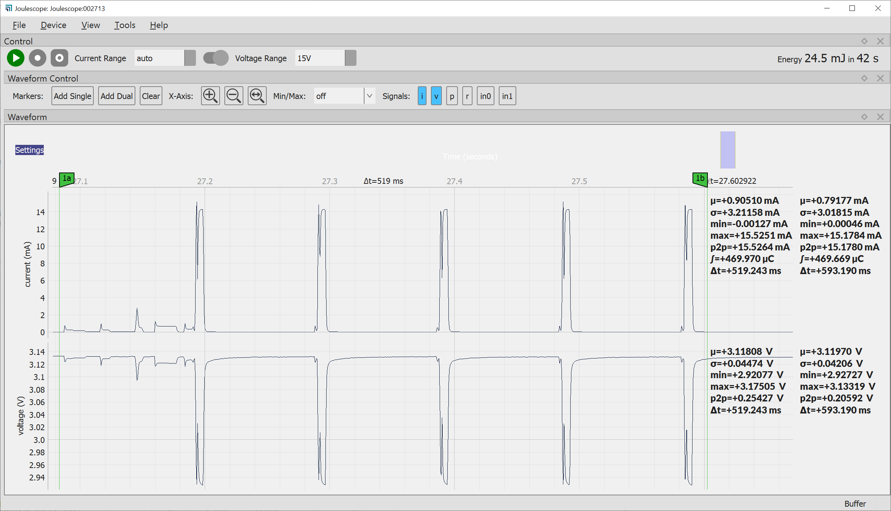

# Current Measurements

Current measurements to estimate battery lifetime using the Joulescope DC energy analyzer, see [joulescope.com](https://www.joulescope.com/).

## Test sensor node - all sensors

- Internal temperature
- BMP180
- Si7021
- Reed switch

### Sleep interval

- Screenshot of Joulescope software, marks between two active phases

- Average sleep current: 1.7 µA

Calculation:

Device | Typical (nA) | Max (nA)
----|----|---
MSP430G2553, LPM3, VLO | 500 | 700
NRF24L01+ | 900 | 900
Si7021 | 60 | 620
BMP180 | 100 | 4000 (temperature extremes)
__Total__ | 1560 | 2320 (BMP180 typical)

### Active phase

- Successful transmission, only one TX, RX interval
- &approx; 100 µAs

- Failed transmission, total 5 TX, RX intervals
- 470 µA &rarr; &approx; 100 µAs per transmission

### Battery life time

- Estimation: SLEEP_DEFAULT = 60 s, in average 2 retransmission
- Average current draw:
  1.7 µA + 200 µAs / 60 s = 5.03 µA
- 200 mAh coin cell CR2032: 200 mAh (e.g. [Energizer datasheet](https://data.energizer.com/pdfs/cr2032.pdf))
  200 mAh / 5.03 µA = 39735 h = 1655 days = 4.53 years
